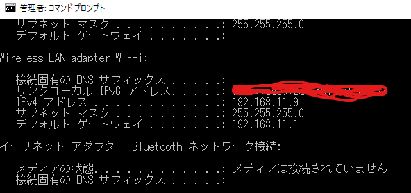

# IPアドレスについて  

基本情報技術者試験にも出題され、IT業界だと常識的なレベルの話です。 

IPアドレスとは、ネットワーク上の自分を示す場所のことです。  
言い換えると、日本における（ネットワーク上の）自分家の住所（IPアドレス）  
という抽象的な説明をもっとわかりやすくしているサイトがあるので、こちらを読んでください。  
https://wa3.i-3-i.info/word172.html  

# 前提知識  
WAN、LAN、パブリック・プライベート  

# 自分のIPアドレスを知る  

※Windows対象  
コマンドプロンプトを起動し、ipconfigを実行して下さい  
  
IPv4と書かれている部分が自分のIPアドレスです。  
(自分のIPアドレスを調べてと言われて、上記の方法で確認することは常識的なレベルなので覚えましょう)  

「192.168.11.9」が自分のIPアドレスです。  

ちなみに自分を示すIPアドレスの表現は他に2つあり  
localhostと127.0.0.1です。
つまり、以下のURLはすべて同じことを意味します。  
```
https://localhost:8080/public/pages/signin.html
https://127.0.0.1:8080/public/pages/signin.html
https://192.168.11.9:8080/public/pages/signin.html
```

# ネットワークの範囲  
IPアドレスはネットワーク部とホスト部に分かれています。  
「192.168.11.9」で言うと、「192.168.11」がネットワーク部、「9」がホスト部となっています。  

ただ、条件次第でネットワーク部が「192.168」、ホスト部が「11.9」になったりします。  
なぜか。このネットワーク部とホスト部はサブネットマスクによって決まるからです。  

先ほどのコマンドプロンプロでのipconfigの実行結果のIPv4の下に  
「255.255.255.0」とあります。これがサブネットマスクです。  

では、ネットワーク部とホスト部がどのように決まるのか  
「192.168.11.9」「255.255.255.0」を8bitの2進数表現で縦に並べると  
```
IPアドレス
11000000.10101000.00001011.00001001
サブネットマスク
11111111.11111111.11111111.00000000
```
サブネットマスクマスクで1となっている部分がネットワーク部  
0となっている部分がホスト部になっています。  

このとき、自分のIPアドレスに対するネットワークアドレスを192.168.11.0と表します。  
サブネットマスクが変わると、このネットワークアドレスも変わります。  
サブネットマスクが「255.255.254.0」の場合だと  
```
IPアドレス
11000000.10101000.00001011.00001001
サブネットマスク
11111111.11111111.11111110.00000000
```
となり、ネットワーク部は「11000000.10101000.0000101」までとなり  
ネットワークアドレスは「192.168.10.0」となります。
→ネットワークアドレスは「11000000.10101000.00001010.00000000」となるため。（00001010が10進数で10を表す）  

# よくある問題  

ネットワーク部は自身が所属するネットワークのアドレス部分  
ホスト部は、そのネットワーク内の番号となるわけです。  

では、以下のような問題の解き方を解説します。  
```
IPアドレス：192.169.24.14 サブネットマスク：255.255.254.0であるとき
このネットワークに接続できる
```