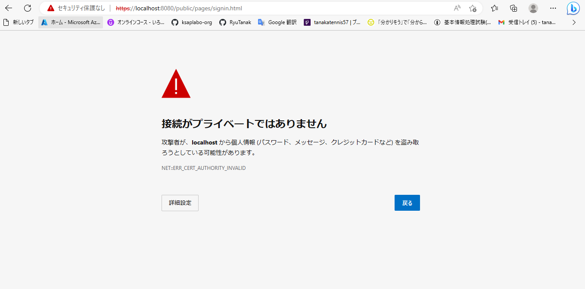
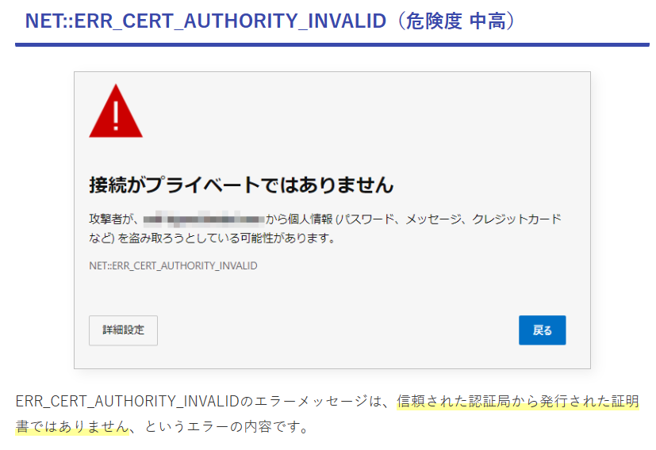

# https通信について  

BookStationでnode.jsを起動した後に  
https://localhost:8080/public/pages/signin.html  
で接続したときに以下の画面が表示される  
  

これって何？  

# https通信とは  

以下のサイトを読んでみた。  
https://wa3.i-3-i.info/word17016.html  

通信プロトコル→通信するときのお約束  
http→ホームページのファイルを受け渡しする時のお約束（通信プロトコル）  
ssl→インターネット上で暗号化通信するときのお約束（通信プロトコル）  
https→httpとsslが合体したもの  

## 暗号化通信の流れ  
sslは暗号化通信するときの流れであることが分かった。  
では、暗号化通信とはどのように行われるのか  

参考  
https://www.toritonssl.com/about_ssl/ssl.html  

1. クライアントがサーバに接続要求  
2. サーバがクライアントにサーバ証明書と公開鍵を提供  
    ※サーバ証明書とはそのサーバが認証局によって、安全性を認められた証拠となるもの  
3. クライアントが共通鍵を生成  
4. クライアントが共通鍵を提供された公開鍵で暗号化し、サーバへ送付  
5. サーバは秘密鍵で共通鍵を解答し、共通鍵を入手  
↓  
その後の通信でクライアントは共通鍵を使って平文を暗号化し、サーバへ送信する  
サーバ側は共通鍵を使用して平文の暗号化を解凍する  

# 本題に戻る  

下記のサイトによると「NET::ERR_CERT_AUTHORITY_INVALID」というのは  
認証局が信頼した証明書を使っていないことが原因であるということ。  
https://security.data-site.info/1828.html
  

今回のWebサーバはnode.jsであり  
https通信をしようとしていますが、確かに証明書の設定とかは何もしていないですね...  

# おれおれ証明書  

では、今回のようにローカルにWebサーバを立てた時に証明書を用意するためにはどうすればいいか  
ここで、よく聞くおれおれ証明書というものを使用することで解決ができる  

(といっても、おれおれ証明書の作り方がむずそうだから今回はここまで)  
