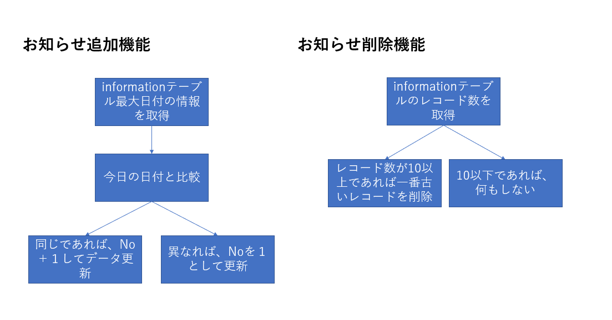

# BookStationの知識  

## informationテーブルのPKについて  
 [こちら](https://github.com/RyuTanak/VUEJS_knowledge/tree/master/DB%E3%81%AE%E3%81%8A%E8%A9%B1)を参照  

## お知らせ編集機能追加に関するヒント  

めちゃめちゃ簡単に処理フローを考えた。  
  

以下にsequelizeで用意されているメソッドの紹介をする  

#### レコードの最大値の取得  

```js
const InformationModel = InformationRepository.getInformationModel(db);

    try {
        return await InformationModel.max(no)
    //以下省略
```

#### 日付が最大かつNoが最大のレコード1行を取得  
(dateとnoで複合キーとなっているため、成り立つ)  
```js
const InformationModel = InformationRepository.getInformationModel(db);

    try {
        return await InformationModel.findOne({
            order: [
                ['date', 'DESC'],
                ['no', 'DESC']
            ]
    //以下省略
```

#### データ挿入  

```js
const InformationModel = InformationRepository.getInformationModel(db);
    try {
        return await InformationModel.create({
            Date : datea,
            no : 101,
            content : "aaaaaa"
        });
    //以下省略
```

#### テーブルのレコードを取得  
```js
const InformationModel = InformationRepository.getInformationModel(db);
    try {
        return await InformationModel.count();
    //以下省略
```

## npmインストール時のエラー  

エラー対処法記事→[こちら](https://qiita.com/ASLA/items/527f5c47ae60bc51cc9a)  
